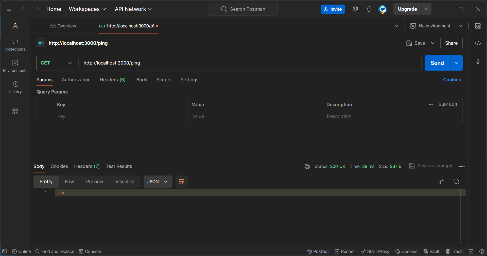

# Slidely Task Backend

## Setup

1. Install Node.js and npm.
2. Run `npm install` to install dependencies.
3. Compile TypeScript files with `npx tsc`.
4. Start the server with `node dist/index.js`.

## After Setup
If the setup is done properly the following message will be displayed in the terminal

## Postman Check
We check using Postman if our api call is working.
1. We run the server
2. We start postman and select GET and put this address in it `http://localhost:3000/ping`
3. We should get `true` like the image below

## Repository

**Frontend**: `https://github.com/ArchitKayal/SlidelyFormApp`
