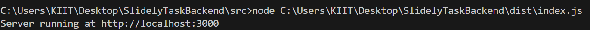

# Slidely Task Backend

## Setup

1. Install Node.js and npm.
2. Run `npm install` to install dependencies.
3. Compile TypeScript files with `npx tsc`.
4. Start the server with `node dist/index.js`.

## After Setup
If the setup is done properly the following message will be displayed in the terminal

